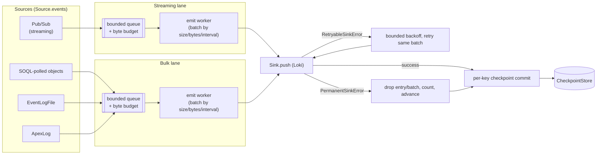

# Architecture

`sf2loki` is a single long-running Python 3.14/asyncio process (running on `uvloop`) that pulls
Salesforce Event Monitoring data in and pushes Loki log lines out. It is built as a
**composition root + frozen-seam** design: one entrypoint (`sf2loki.app.App.build`) wires concrete
implementations behind four small `Protocol` interfaces, and everything else in the codebase only
ever talks to those interfaces. That is what lets sources, the sink, checkpoint storage, and HA
leadership evolve independently — a new source or a new checkpoint backend is a new class behind
an existing seam, not a change to the pipeline that drains it.

This page describes the current shape of that design: the seams, the data types that cross them,
how a record flows from Salesforce to Loki, why backpressure is structural rather than a queue
you can silently overflow, and how multi-org ingestion and active-passive HA plug into the same
seams with zero changes to sources or the sink.

## The four frozen seams

Every producer, the sink, every checkpoint backend, and every HA coordinator implement one of
four `Protocol`s defined in `src/sf2loki/{sources,sinks,state,coordinate}/base.py`. "Frozen" means
call-sites only depend on the signature below, never on a concrete implementation.

### `Source`

```python
class Source(Protocol):
    name: str

    def events(self, state: CheckpointStore, stop: asyncio.Event) -> AsyncIterator[LogEntry]: ...
```

An async generator of `LogEntry`. It is handed the shared `CheckpointStore` (to resume from its
last position on startup) and a `stop` event (to end its stream cooperatively on shutdown or
leadership loss). Streaming and polling sources look identical from the pipeline's point of view —
`sf2loki.sources.pubsub_source.PubSubSource` yields on gRPC delivery, `EventLogObjectsSource`
yields on a SOQL poll tick — because both are just `events()`.

### `Sink`

```python
class Sink(Protocol):
    async def push(self, batch: Batch) -> None: ...
    async def aclose(self) -> None: ...
```

`push` either succeeds, or raises one of two typed errors that the pipeline treats very
differently:

- **`RetryableSinkError`** — transport failure, 429, 5xx, or an auth/config error (401/403).
  The batch is intact; the pipeline backs off and retries the *same* batch, honouring
  `Retry-After` where the sink parses one.
- **`PermanentSinkError`** — a 400 or 413 the sink cannot recover from even after a 413 splits
  the batch. The pipeline drops the offending entry/batch, counts it
  (`sf2loki_loki_entries_dropped{reason=...}`), and advances the checkpoint past it — a single
  poison payload must never wedge the whole pipeline.

The only implementation today is `sf2loki.sinks.loki.sink.LokiSink` (protobuf+snappy by default,
JSON+gzip for debugging), but nothing about the pipeline is Loki-specific — a second `Sink` could
be added without touching sources or state.

### `CheckpointStore`

```python
class CheckpointStore(Protocol):
    async def load(self, key: str) -> str | None: ...
    async def commit(self, key: str, value: str) -> None: ...
```

Durable resume state, keyed per source stream (e.g. `pubsub:/event/LoginEventStream`,
`eventlog_objects:LoginEvent`). Three backends implement it — file, S3, GCS — described in
[Checkpoint stores](#checkpoint-stores) below. Real stores also expose a handful of **duck-typed**
extras the protocol itself doesn't declare (`commit_many`, `reset`, `set_fence`, `set_epoch`) —
optimizations and HA hooks that only some call-sites need, so they aren't forced onto every
implementation (including test fakes).

### `Coordinator`

```python
class Coordinator(Protocol):
    async def run(
        self,
        *,
        on_acquire: Callable[[], Awaitable[None]],
        on_lose: Callable[[], Awaitable[None]],
        stop: asyncio.Event,
    ) -> None: ...
```

Owns active-passive leadership. `run` calls `on_acquire` once this instance becomes leader and
`on_lose` if it's ever displaced — potentially more than once over the process's lifetime for a
standby that acquires, loses, and re-acquires. `NoopCoordinator` (the default) calls `on_acquire`
immediately and never calls `on_lose`; see [HA / coordinators & fencing](#ha-coordinators-fencing)
for the two real implementations.

## Core data types

Defined in `src/sf2loki/model.py`, shared across all four seams:

- **`CheckpointToken`** — `key: str`, `value: str`. `key` namespaces a stream; `value` is the
  opaque resume position (a base64 `replay_id` for Pub/Sub, an ISO-8601 timestamp for polling).
- **`LogEntry`** — `timestamp: datetime`, `labels: Mapping[str, str]`, `line: str`,
  `structured_metadata: Mapping[str, str]`, `checkpoint: CheckpointToken`,
  `checkpoint_only: bool = False`. A `checkpoint_only` entry (e.g. a Pub/Sub keepalive's
  `latest_replay_id`) carries a checkpoint advance with no log payload — the pipeline never sends
  it to the sink, only commits its token, and only after any real entries queued ahead of it on the
  same key have been pushed. `LogEntry` also memoizes its own UTF-8 byte length
  (`line_nbytes()`) so the several places that need it on the hot path (queue byte accounting,
  batch sizing, the sink's line cap) don't each re-encode the string.
- **`Batch`** — `entries: list[LogEntry]`. What one `Sink.push()` call carries.

## Data flow



`sf2loki.app.Pipeline` is the one consumer of every `Source`. Each enabled source runs as its own
producer task feeding a bounded `asyncio.Queue`; a lane's single consumer task drains that queue,
accumulates entries into a `Batch` (flushed on whichever of `batch.max_entries` /
`batch.max_bytes` / `batch.flush_interval` is hit first), calls `Sink.push`, and — only after a
successful push, or a deliberate permanent drop — commits the last `CheckpointToken` per key seen
in that batch. Checkpoints are written **after** the sink has the data, which is what makes
delivery at-least-once rather than at-most-once: a crash between push and commit re-sends already
delivered rows, it never loses them.

### Backpressure is structural, not a queue you can silently overflow

There is no drop-oldest / drop-newest queue policy. When a lane's bounded queue fills — by entry
count (`batch.queue_maxsize`) or by approximate bytes (`batch.queue_max_bytes`) — the producer's
`await queue.put(...)` simply blocks. For the Pub/Sub source that block propagates all the way
back to the wire: the producer stops draining gRPC responses, so it stops sending `FetchRequest`
top-ups when its outstanding flow-control credits (`pending_num_requested`) run low, so Salesforce
itself stops pushing new events on that subscription. A slow or down Loki therefore throttles
ingestion at the source instead of buffering unboundedly in memory or silently dropping records.
The visible symptom is rising `sf2loki_ingest_lag_seconds` and (past
`service.unready_after_sink_failing`) a degraded `/readyz`, not data loss — see
[Metrics](observability/metrics.md) for the gauges to alert on.

## Lanes: bulk can't starve streaming

Sources are split into two lanes by class, each with its own bounded queue, byte budget, and emit
worker — so a multi-million-row EventLogFile drain never head-of-line-blocks a live Pub/Sub
stream:

- **Streaming lane** — Pub/Sub sources only.
- **Bulk lane** — everything else: EventLogFile, SOQL-polled objects (including big-object
  descending drains), and ApexLog.

Consequences of the split:

- Up to **two** Loki pushes are in flight at once (one per lane); with a single lane configured
  (e.g. Pub/Sub disabled) behavior is identical to one shared queue.
- **Per-key commit ordering is preserved** — a given source's checkpoint keys are disjoint and
  stay within one lane, so checkpoints for that key are still committed in the order they were
  produced.
- Worst-case buffered memory is bounded at **`n_lanes × queue_max_bytes`** (at most 2×, never
  unbounded), because each lane carries its own full byte budget independently of the other.
- **`sink_failing_since` is aggregated as the earliest failing lane**, not the latest — so a
  healthy streaming lane recovering quickly can never mask a bulk lane that has been wedged
  against Loki for an hour. `/readyz` degrades based on that earliest failure once it exceeds
  `service.unready_after_sink_failing`.

## The source types

Five ingestion configurations, four `Source` implementations — Pub/Sub covers two of them because
custom events and CDC reuse the same streaming engine as RTEM:

- **Pub/Sub streaming** (`sources.pubsub`) — gRPC + Avro subscription to Salesforce Real-Time
  Event Monitoring channels (`/event/LoginEventStream`, …). Lowest latency of the five.
- **Pub/Sub custom platform events & CDC** — the same `pubsub_source.py` engine subscribing to
  your own `/event/My_Event__e` or `/data/AccountChangeEvent` topics; no engine change, just
  different topic names.
- **SOQL-polled objects** (`sources.eventlog_objects`) — timestamp-watermark polling of any
  queryable sObject, including the stored RTEM `*Event`/`*EventStore` Big Objects (descending-drain
  mode) and your own custom objects.
- **EventLogFile** (`sources.eventlogfile`) — lists and downloads `EventLogFile` CSV blobs, one
  Loki entry per CSV row, schema-agnostic (reads each file's own header).
- **ApexLog** (`sources.apexlog`, opt-in, off by default) — Tooling API polling of Apex debug
  logs, a standalone developer-debugging category with no overlap against the other four.

See [Sources](sources/index.md) for full per-source configuration, and the **either/or-per-category
overlap rule** that stops the same activity being double-counted across sources.

## Multi-org ingestion

One process can ingest several Salesforce orgs into one shared Loki sink. Replacing the top-level
`salesforce:`/`sources:` config with an `orgs:` list wraps each org's raw sources in
`sf2loki.sources.org_adapter.OrgSource`, which:

- injects the `org` stream label plus that org's own `sf_org_id`/`environment` into every entry
  the inner source yields — `org` stays orthogonal to `source`, so dashboards can slice by either;
- rewrites every checkpoint key with an `org=<name>:` prefix via `state/org_view.py`'s
  `OrgCheckpointView`, so two orgs sharing one checkpoint store never collide;
- preserves the **first** configured org's legacy unprefixed keys as a load-time fallback, so a
  deployment upgraded from single-org to multi-org resumes from its existing state file with no
  manual migration step — don't "fix" that fallback away, it's the upgrade path;
- gives each org its own `TokenProvider` and Salesforce clients, so per-org API limits/throttling
  apply independently and one org's auth outage doesn't stop the others — `App` fails startup only
  if *every* org's auth fails, otherwise the failing org is logged, surfaces a
  `degraded: org <name> auth failing` readiness reason, and keeps retrying auth reactively.

Single-org deployments never construct an `OrgSource` — behavior is bit-identical to
pre-multi-org. See [Configuration](configuration/index.md) for the `orgs:` schema.

## Label / cardinality strategy

Only a fixed allowlist of Loki stream labels is ever permitted
(`src/sf2loki/sinks/loki/labels.py:ALLOWED_LABELS`):

```text
job, service_name, source, event_type, sf_org_id, environment, org
```

A startup guard (`guard_labels`/`guard_static_labels`) rejects any operator-supplied
`sink.loki.labels` key outside that set, and separately rejects `source`/`event_type` from ever
appearing there — those two are per-entry identity set by the sources themselves, and a static
override would collapse stream separation across every entry. Everything high-cardinality
(`user_id`, `source_ip`, `replay_id`, session keys, arbitrary object/CSV columns) goes into
`structured_metadata` or the JSON `line`, never a label. That discipline is what keeps active
Loki streams in roughly the 30–90 range for a typical deployment regardless of event volume — see
[Metrics](observability/metrics.md) for the cardinality-relevant gauges to watch.

## Checkpoint stores

Three `CheckpointStore` backends, same conditional-write shape — a whole checkpoint document per
instance, written with a compare-and-swap so a second writer fails fast instead of silently
clobbering:

- **File** (default) — local JSON, atomic tmp-then-rename writes, a `flock`ed lock sidecar held
  for the process's lifetime as the single-instance exclusivity mechanism.
- **S3** (`sf2loki[s3]` extra) — `If-Match` ETag compare-and-swap (`If-None-Match: *` for the
  first write); a losing writer gets `StateStoreConflictError` instead of clobbering.
- **GCS** (`sf2loki[gcs]` extra) — the same shape using GCS **generation preconditions**
  (`ifGenerationMatch`) instead of an ETag, raising the same `StateStoreConflictError`.

S3 and GCS need no mounted volume, so they're the fit for stateless compute (Fargate, Cloud Run,
ECS with ephemeral storage). See [State & Checkpoints](deployment/state.md) for setup, and
[High Availability](deployment/high-availability.md) for how the file store's exclusive lock
interacts with a real `Coordinator` (it must **not** also hold its own flock under a coordinated
HA pair — the coordinator is the exclusivity mechanism there instead).

## HA / coordinators & fencing

By default `NoopCoordinator` makes the single instance leader forever — `sf2loki` is
single-instance by design because the Pub/Sub API has no consumer-group semantics; two replicas
subscribed to the same topic both receive (and both ingest) every event. Active-passive HA adds a
real `Coordinator` with zero changes to sources, sink, or state:

- **`FileLeaseCoordinator`** — a small JSON lease document (`holder`, `expires_at`, `epoch`) on
  storage shared by both replicas (NFS/EFS/shared volume). Expiry is wall-clock, so replicas must
  stay NTP-synced. Deliberately not `flock` (unreliable over NFS, doesn't survive a holder that
  dies without releasing) — instead atomic tmp-then-rename plus a pause-then-reread to detect a
  contested takeover.
- **`K8sLeaseCoordinator`** — the same acquire/hold/pause loop shape over a
  `coordination.k8s.io/v1` `Lease`. Optimistic concurrency uses the Lease's `resourceVersion`, so a
  lost CAS returns HTTP 409 (the race signal itself) and there is no separate pause-then-verify
  step. Staleness is judged on each replica's own monotonic clock against `resourceVersion`
  changes, not the Lease's wall-clock `renewTime` — so cross-host clock skew can't cause a
  premature or delayed takeover.

Both wire into checkpoint commits via **fencing**: `StateFenceError` (defined in
`coordinate/base.py`) is raised when an instance that has lost leadership — e.g. during a GC pause
— tries to commit a checkpoint anyway. `app.py` plugs a coordinator's fence check into the state
store via the store's duck-typed `set_fence(...)` hook, so a stale leader can never advance
checkpoints and race the new leader. A fenced commit is not data loss: the batch already landed in
Loki, so the cost is at most a bounded re-ingest (up to one lease `ttl`/`lease_duration`) after the
new leader resumes — the same at-least-once guarantee that governs ordinary retries. The S3/GCS
stores don't need the epoch/fence mechanism at all: their own ETag/generation compare-and-swap
already rejects a losing writer independently.

See [High Availability](deployment/high-availability.md) for the full failover walkthrough,
config, and the `/readyz`-vs-`/healthz` probe split that makes a standby's permanent `503` safe.
